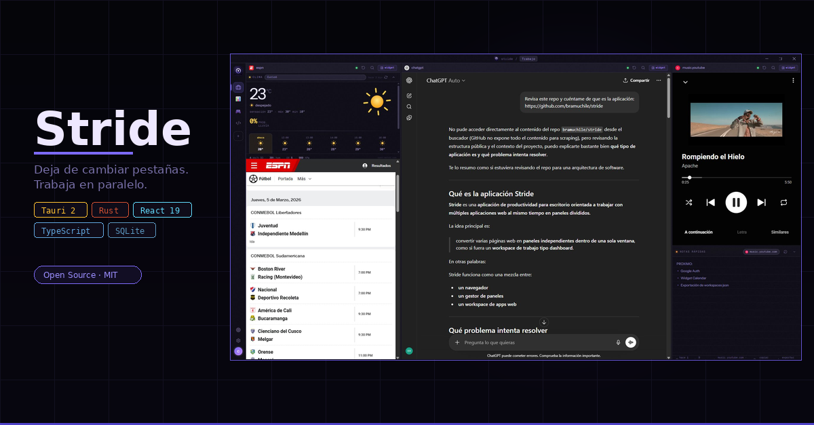

# Stride



**A multi-panel desktop workspace for focused work.**
Open Gmail, Calendar, GitHub, and your daily apps side-by-side — no tabs, no browser clutter.


[](https://github.com/bramuchile/stride/releases)
[](https://github.com/bramuchile/stride/releases)
[](./LICENSE)
[](https://tauri.app)
[](https://react.dev)

> **Status:** Active development — Windows only.

---

## What is Stride?

Stride is a desktop shell that organizes web apps into configurable **Workspaces** with real, native WebView2 panels — not iframes, not browser tabs.

Each panel runs a full WebView2 instance with a **shared session**: sign in to Google once and every panel (Gmail, Calendar, Drive, Meet) picks it up automatically.

Panels can also host **integrated widgets** — lightweight tools like notes or weather that dock inside the panel area, with configurable height overlays above or below the web content.

---

## Download

Pre-built installers are available on the [Releases page](https://github.com/bramuchile/stride/releases).

| Installer | Format |
|-----------|--------|
| [`Stride_0.3.4_x64-setup.exe`](https://github.com/bramuchile/stride/releases/download/v0.3.4/Stride_0.3.4_x64-setup.exe) | NSIS installer |
| [`Stride_0.3.4_x64.msi`](https://github.com/bramuchile/stride/releases/download/v0.3.4/Stride_0.3.4_x64_en-US.msi) | MSI package |

**Requirements:** Windows 10/11 (x64). [WebView2 runtime](https://developer.microsoft.com/en-us/microsoft-edge/webview2/) is bundled with the installer.

---

## Features

**Panels & Layouts**
- **Dynamic free layout** — drag column and row dividers freely; any number of columns and rows per workspace
- **Layout templates** — start from Free (1 panel), Double (2 columns), Triple (3 columns), or Quad (2×2) at creation time
- **Shared session** — cookies and localStorage shared across all panels via a single WebView2 profile; sign in to Google once, all panels pick it up
- **Per-panel address bar** — navigate or search within any panel
- **Drag-to-resize** — drag column and row separators; sizes persist per workspace
- **Deferred loading** — WebViews are created once and shown/hidden on workspace switch (never recreated)
- **Bookmarks** — save and quick-launch sites from the empty panel screen

**Widgets**
- **Notes widget** — per-panel persistent notes with markdown rendering (headings, bullets, checkboxes, code, links), view/edit toggle, auto-save (500ms debounce), version history (last 10), pin a note above the editor, word count, collapsible
- **Weather widget** — current conditions via Open-Meteo (no API key required), automatic geolocation or manual city entry, dynamic color theming
- **Widget overlays** — widgets dock above or below the WebView area (not floating), with configurable height; collapse to a 28px bar

**Workspaces**
- **Guided onboarding** — first-launch wizard: name, icon, and layout template
- **Create & edit workspaces** — choose name, emoji/icon, and configure panels
- **Keyboard navigation** — `Ctrl+1…9` to jump to any workspace, `Ctrl+Tab` to cycle

**Focus Mode**
- **Two-layer ad blocking architecture**:
  - **Layer 1 — Native network blocking (Rust)**: `WebResourceRequested` handler registered via `webview2-com` intercepts every network request *before it leaves the browser engine*. Requests matching the domain blocklist are cancelled with a synthetic empty response — zero latency, zero timeout wait. Handler reads `FOCUS_MODE_ENABLED` AtomicBool on every request; toggle is instant across all existing WebViews.
  - **Layer 2 — YouTube scriptlet layer (JS)**: `focus_filter.js` injected as `initialization_script` handles YouTube-specific ad elimination that can't be done at the network level (player JSON pruning, SPA navigation, anti-detection).
- **WebView lifecycle**: panels are created on `about:blank`, the native handler is registered, then navigation to the real URL begins — ensures zero requests escape before the handler is active.
- **YouTube coverage**:
  - `ytInitialPlayerResponse` + `playerResponse` + `ytInitialData` intercepted via `Object.defineProperty` — ad slots pruned from player JSON before the player reads them
  - SPA-safe: re-attaches on every `yt-navigate-finish` event (CSS injection, enforcement observer, player observer)
  - Auto-skip fallback via `MutationObserver` on `#movie_player` classList (replaces polling — zero CPU overhead during normal playback)
  - Enforcement interstitial observer re-attaches on each SPA navigation
- **Filter lists**: EasyList + EasyPrivacy combined, bundled as compile-time fallback, auto-updated every 7 days from `easylist.to`; `should_block(url)` matches hostname and all parent domain suffixes
- **Persistent toggle** — stored in SQLite; restored before any WebView is created (no race condition)
- **Dynamic toggle** — enable/disable without panel reload via `FOCUS_MODE_ENABLED` AtomicBool (Rust) + `stride:focus-toggle` CustomEvent (JS CSS layer)

**Shell**
- **Custom titlebar** — frameless, Windows 11-style controls (minimize/maximize/close), active workspace name, update notification banner
- **Slim sidebar** — 52px, workspace icons with active indicator (accent pill + glow), hover tooltips
- **Panel header** — site favicon, connection status dot, back/forward, reload, address bar, and split/bookmark controls
- **Presentation mode** — hides all panel headers for a clean, distraction-free view

**WebView2 reliability**
- Standard Chrome user agent — fixes WhatsApp Web, Google Meet, and other sites that reject non-browser UAs
- External popups redirect to the system browser instead of opening a new WebView
- Permission handler for camera, microphone, geolocation, and notifications

**System**
- **Auto-update** — background update check on launch; banner in titlebar with one-click install
- **Error reporting** — "Copy error" button formats diagnostics for GitHub Issues

---

## Tech Stack

| Layer | Technology |
|-------|------------|
| Desktop shell | Tauri 2 + Rust |
| WebView engine | WebView2 (Windows) |
| Frontend | React 19 + TypeScript + Vite |
| UI components | shadcn/ui + Tailwind CSS v4 |
| State | Zustand |
| Data | TanStack Query + SQLite (tauri-plugin-sql) |

---

## Building from Source

### Prerequisites

- [Node.js](https://nodejs.org/) ≥ 20
- [Rust](https://rustup.rs/) (stable toolchain)
- [Tauri v2 prerequisites](https://v2.tauri.app/start/prerequisites/) — Microsoft C++ Build Tools + WebView2 runtime

### Development

```bash
npm install
npm run tauri dev
```

On first run, SQLite migrations execute and the onboarding wizard guides you through creating your first workspace. The database is stored at `%APPDATA%\stride\stride.db`.

### Production Build

```bash
npm run tauri build
```

Installer artifacts are output to `src-tauri/target/release/bundle/`.

---

## Project Structure

```
stride/
├── src/
│   ├── App.tsx                          # Root: DB init, onboarding check, AppShell
│   ├── types/index.ts                   # Workspace, Panel, DynamicLayout, WidgetId
│   ├── store/useWorkspaceStore.ts       # Zustand: activeWorkspaceId, webviewMap, presentationMode
│   ├── lib/
│   │   ├── db.ts                        # SQLite singleton + migrations
│   │   ├── seed.ts                      # No-op (onboarding creates first workspace)
│   │   ├── layoutTemplates.ts           # Template instantiation (free/double/triple/quad)
│   │   └── workspaceConstants.tsx       # Icon and layout options
│   ├── hooks/
│   │   ├── useWebviews.ts               # WebView2 lifecycle + layout constants
│   │   ├── useDynamicLayout.ts          # Dynamic layout CRUD (columns, rows, fractions)
│   │   ├── useWorkspaces.ts             # Workspace CRUD (TanStack Query)
│   │   ├── usePanels.ts                 # Panels per workspace (TanStack Query)
│   │   ├── useNotes.ts                  # Per-panel notes persistence
│   │   ├── useBookmarks.ts              # Bookmark CRUD
│   │   ├── useWeather.ts                # Open-Meteo API integration
│   │   └── useKeyboardShortcuts.ts      # Ctrl+1..9, Ctrl+Tab
│   └── components/
│       ├── onboarding/                  # OnboardingFlow (welcome + workspace setup)
│       ├── layout/                      # AppShell, Titlebar, DynamicPanelGrid, PanelSlot
│       ├── sidebar/                     # Sidebar, WorkspaceItem, FocusModeButton
│       ├── panels/                      # PanelHeader, WebPanel, WidgetPanel, PanelOverlay, AddressBar
│       ├── workspace/                   # WorkspaceDialog (create/edit)
│       ├── settings/                    # SettingsDrawer
│       ├── widgets/                     # notes/, weather/, next-meeting/, scratchpad/
│       └── error/                       # ErrorBoundary + ErrorDisplay
└── src-tauri/
    ├── filters/
    │   └── easylist_domains.txt         # Bundled ad domains (compile-time fallback)
    └── src/
        ├── lib.rs                       # Plugin registration + startup init
        ├── filters.rs                   # FilterEngine + EasyList + EasyPrivacy + should_block() + FOCUS_MODE_ENABLED AtomicBool
        ├── focus_filter.js              # JS scriptlet layer: ytInitialPlayerResponse/playerResponse/ytInitialData pruning, fetch/XHR override, CSS, auto-skip, anti-detection
        └── commands/
            ├── webview.rs               # create/resize/show/hide/navigate WebViews + WebResourceRequested native handler
            ├── focus.rs                 # set_focus_mode / get_focus_mode Tauri commands
            ├── permissions.rs           # Permission cache (camera, mic, geolocation, notifications)
            └── tooltip.rs               # Tooltip overlay window (above WebView2 children)
```

---

## Focus Mode Architecture

Focus Mode uses a two-layer approach to eliminate ads with zero latency:

### Layer 1 — Native network blocking (Rust, `webview.rs`)

Registered via `with_webview` + `webview2-com` (same pattern as `permissions.rs`):

```
Panel created on about:blank
  → WebResourceRequested handler registered (AddWebResourceRequestedFilter "*" ALL)
  → Navigation to real URL begins
    → Every request: filters::should_block(&uri) checked in Rust
      → Match: CreateWebResourceResponse(empty, 200) — request never leaves engine
      → No match: request passes through normally
```

- `FOCUS_MODE_ENABLED` AtomicBool read on every request — toggle is instant
- `filters::should_block(url)` matches hostname + all parent domain suffixes against EasyList + EasyPrivacy combined list

### Layer 2 — YouTube scriptlet layer (JS, `focus_filter.js`)

Handles what network blocking cannot — the YouTube player's internal ad data:

- `Object.defineProperty` on `ytInitialPlayerResponse`, `playerResponse`, `ytInitialData` — prunes `AD_KEYS` from player JSON before the player reads it
- fetch/XHR override — blocks remaining third-party ad requests not caught at network level
- `MutationObserver` on `#movie_player` classList — auto-skip fallback, zero polling overhead
- Enforcement interstitial observer — re-attaches on every `yt-navigate-finish`
- CSS injection — hides ad slot elements, re-injected on every SPA navigation

### Key implementation notes

- **`auxiliaryUi` is intentionally excluded from `AD_KEYS`** — it contains non-ad overlays (age-gate, DRM notices); deleting it causes error 282054944 in the YouTube player
- **`/api/stats/ads`, `/ptracking`, `/generate_204`, `/watchtime` are NOT blocked** — these are YouTube server-side signals; blocking them activates enforcement mode
- **Layers 3/4 (script tag manipulation) were removed** — the regex approach corrupted inline JSON causing 403 errors on `googlevideo.com`; pruning via `Object.defineProperty` on the parsed object is safe and sufficient

---

## Keyboard Shortcuts

| Shortcut | Action |
|----------|--------|
| `Ctrl+1` … `Ctrl+9` | Switch to workspace N |
| `Ctrl+Tab` | Next workspace |
| `Ctrl+Shift+Tab` | Previous workspace |

---

## Roadmap

### Done
- [x] Dynamic free layout (resizable columns and rows, unlimited panels)
- [x] Shared WebView2 session (single login, all panels)
- [x] SQLite persistence (workspaces, panels, notes, history, bookmarks)
- [x] Deferred WebView loading (create once, show/hide)
- [x] Drag-to-resize panels with persisted sizes
- [x] Widget overlay architecture (top/bottom dock, configurable height, collapsible)
- [x] Notes widget — markdown, history, pin, auto-save, word count
- [x] Weather widget — Open-Meteo, geolocation, dynamic theming
- [x] Guided onboarding (welcome + workspace setup wizard)
- [x] Custom titlebar (frameless, Windows 11 controls, drag region, update banner)
- [x] Sidebar with workspace switcher and icon support
- [x] Create & edit workspaces dialog
- [x] Keyboard shortcuts (Ctrl+1…9, Ctrl+Tab)
- [x] Presentation mode (hides panel headers)
- [x] Bookmarks (quick-launch from empty panel screen)
- [x] WebView2 hardening (user agent, popup redirect, permission handler)
- [x] Auto-update via GitHub Releases
- [x] Error boundary with formatted diagnostics
- [x] Focus Mode — two-layer ad blocking: native WebResourceRequested (Rust, zero latency) + YouTube scriptlet layer (JS, SPA-safe)

### Next
- [ ] Empty panel screen — new-tab style with full bookmarks grid and quick access
- [ ] Next Meeting widget — Google Calendar API integration
- [ ] Export / import workspaces as JSON
- [ ] Focus Mode Phase 3 — adblock-rust engine + full EasyList/EasyPrivacy rule syntax (paths, wildcards, cosmetic filters)

### Future
- [ ] Additional widgets: Focus Timer, Daily Briefing, Asset Price, Service Status
- [ ] Cloud sync (Pro plan)
- [ ] macOS + Linux support

---

## Contributing

Stride is open source. If you find a bug, use the **"Copy error"** button on the error screen and paste the output into a [new issue](../../issues).

Pull requests are welcome. For significant changes, open an issue first to discuss the approach.

---

## License

[MIT](./LICENSE)